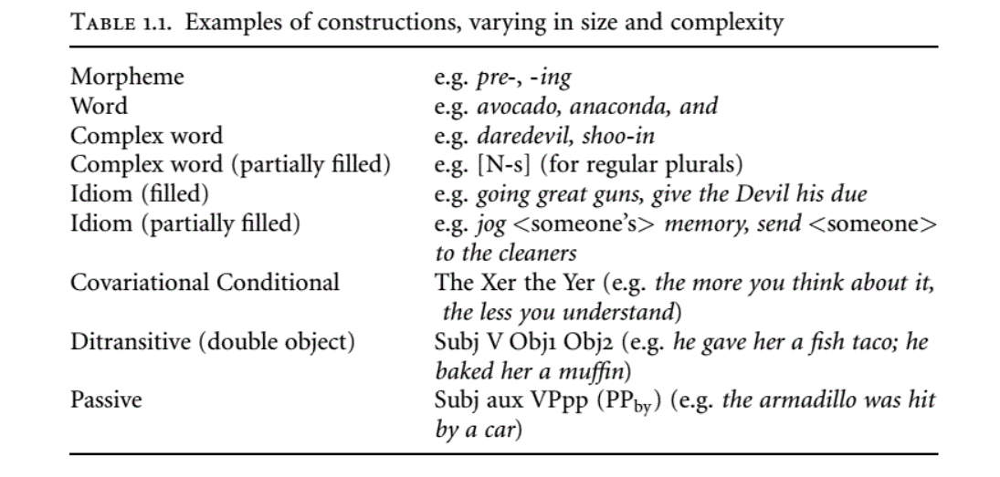
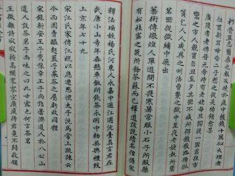
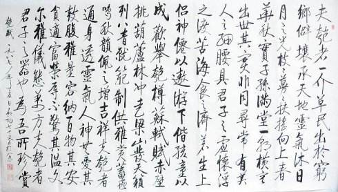
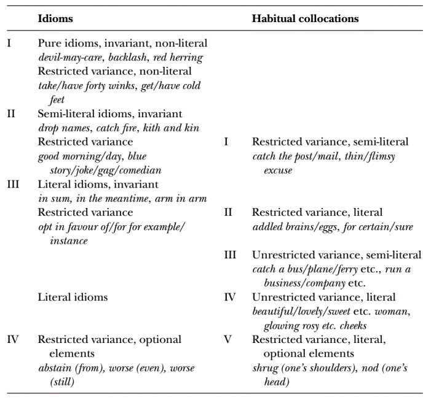
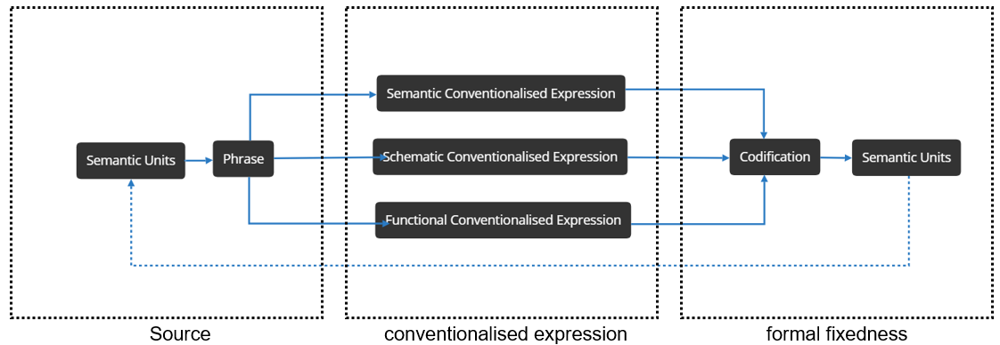

Re-examine the Grammar Approach to Idioms in Chinese

# Introduction

Scholars have modified the definition of idiom and idiomaticity significantly,
after which the non-compositionality has become the essential criterion of idiom
(Carter, 2012; Fernando & Flavell, 1981; Mel’cuk, 1995; Nunberg, Sag, & Wasow,
1994). On one hand, multiple researchers consider idiom as non-compositional
unit from diverse perspectives, for instance, Meaning-Text theory (Iomdin, 2010
cited in Apresjan, V., 2014; Mel’cuk, 1995), generative grammar (Chomsky, 2014;
Jackendoff, 1997) and construction grammar (Fillmore, Kay, & O'connor, 1988).
Oppositely, the conflicting stance is developing rapidly, for example, idioms
sometimes exhibit some compositionality (McGinnis, 2002; Nunberg et al., 1994).
Interestingly, both lines of research attempt to separate two types of idioms
which differentiated by levels of compositionality, such as 'decoding and
encoding idioms' (Fillmore et al., 1988) and 'idiomatically combining
expressions and idiomatic phrases' (Nunberg et al., 1994). In this debate, the
scope of idiom seems to be extensive, covering both the completely
non-compositional idiom and considerable 'incipient' idiom. Sometimes, this
broad definition regarded compositionality as the result of semantics-syntax
interaction, a general language feature beyond idiomaticity (Langacker, 1986;
Mateu & Espinal, 2007; McGinnis, 2002; Nunberg et al., 1994).

Concerning this possibly ambiguous boundary between idiom and daily language, a
new paradigm to account for idiomaticity is necessary. Several scholars have
tried to address this problem, for instance, Grant and Bauer (2004) strictly
separated the 'core idiom' (purely non-compositional one) from the other
'figurative expression'. In a different way, criteria-based definitions provide
insights on identifying idiom via certain typical features, which to some extent
stretch the scope of idiom (e.g. Fernando & Flavell, 1981; Nunberg et al.,
1994). Some researchers (e.g. Bybee, 1998; Fillmore et al., 1988; Goldberg,
2006; Wulff, 2008) indicate that not only phrases but also lexical items can be
idiomatic, which again expand the attribute of idiomaticity from core idioms to,
if not all of the language, a larger linguistic pool.

Aligning with the last theory (see Goldberg, 2006; Wulff, 2008), the present
essay is to propose that idiom is a natural and systematic language phenomenon
similar to the single lexicon. Supplementing the work of construction grammar,
this essay is to re-examine this scheme in Chinese and construct a new model of
grammar to account for idiomaticity. There are two main reasons why I
concentrate on Chinese. Firstly, the investigations on construction grammar's
perspective towards idiom are predominantly English-based, lacking the
verification from other languages. Secondly, to transcribe and analyse
linguistic data, scholars always depend on a certain writing system, which may
influence the interpretation of findings.

# Lexicon and Idiom

Phraseology research contributes to our comprehension of the idioms. Generative
grammarians like Katz and Postal (1963) indicate that idiom is
'phrase-idiom-part' contrasting 'lexical part'. Dissimilarly, the investigators
of phraseology do not separate idioms from any linguistic level, but identify
them as a subsection of multiword units (Pawley, 1985). To develop this
deconstruction of idiomaticity, researchers start to draw analogies between
idiom creation and other multiword unit creations (e.g. Goldberg, 2006). It
culminates in the paradigm which regards all these multiword units (e.g. core
idioms, collocations) as a continuum of fixed expressions (Alexander, 1984;
Carter, 2012; Cowie, Mackin, & McCaig, 1983; Nattinger & DeCarrico, 1992).

Furthermore, this model was extended again to account for lexicons. Previous
scholars have promoted that the same cognitive process happens in lexicon
creation (Fernando, 1996), multiword expression creation (e.g. Fillmore et al.,
1988; Goldberg, 2006), and even metaphor creation (Lakoff, 1987; Lakoff &
Johnson, 1980). They view lexicon and idiom as dissimilar formation sharing the
same underlying cognitive process. For instance, in construction grammar,
different formations of language are assigned with different construction types
(see Table 2.1).

Table 2.1: 'examples of constructions, varying in size and complexity'
(Goldberg, 2006, p. 5)

The present essay, corresponding to the cognitive explanation to the feature of
idiomaticity, attempts to further consider the relation between lexicon and
idiom. It can be seen from Table 2.1 that morpheme or word, although counted as
constructions which can share the feature of idiomaticity, are different from
idioms. Intuitively, this stance is perfectly reasonable because they are two
distinct writing structures including single lexicon and multi-word expressions.
However, if reassessing this English-based theory with Chinese, the author
discovers that these levels may not fundamentally isolate from each other.

Chinese writing system, unlike English one, does not present morphological
change within one word[^1]. In English, pluralisation may appear as 'X' to 'Xs',
whereas the counterpart in Chinese will happen with inserting one or even more
characters. For example, the Chinese character '们' (mén; pluralisation marker
for person) can be used for 朋友们 (péng yǒu mén; friends) or 同胞们 (tóng bāo
mén; fellow citizens). Similarly, presented by Table 2.2, multiple verb
conjugation affixes such as '-ed', '-ing' or '-en' are auxiliary words in
Chinese. In this case, the idiom creation is nearly the same as lexicon
creation, which both involves the combination of Chinese characters.

[^1]: (there is still opposite ideas, and more details can see Bates, Chen, Li,
    Opie, & Tzeng, 1993 and also the references within)

Table 2.2 Comparison of Verb Conjugation Between Chinese and English

Note: those without tone is neutral tone which frequently appears in auxiliary
words

This data may bring about two levels of interpretation: (1) The existence of an
identical principle under both word creation and idiom creation can be supported
in Chinese, which shows universality to some extent; (2) The relation between
lexicon and idiom may not be what described as 'different formation but the same
cognitive process' in the original construction grammar theory in English;
however, they are actually 'the same formation and the same cognitive process'.

The comparison of different languages above may provide us with an insight that
the 'transcription' of oral linguistic data via certain writing system may
affect the judgement of researchers. The author would like to appeal for the
researchers to use phonetic or phonological approach to language, which means
treating the minimal meaningful phoneme as the basic level of language. In the
new system, all the morphological, lexical, and idiomatic combination can be
redefined to be the combination of meanings.

# Sentence and Idiom

From phraseology level to discourse level, the author starts to consider whether
sentence processing can be included in the meaning combination paradigm promoted
in Section 2. It has to be noticed that the concept of 'sentence', apart from
the semantic meaning which will be examined in this section, contains schematic
meaning presented by the model from Goldberg (2006). Therefore, the author will
assess this important feature in Section 4.

The first concentration of this part is ancient Chinese and other writing
systems with less or no punctuation. The logographic writing systems, such as
Chinese, do not necessitate punctuation and spacing. Specifically, no
punctuation was employed in ancient Chinese texts presented by Figure 3.1,
although some symbols such as '└' may be used to suggest the finish of chapters
(Lin, 2004). As of Song dynasty (960–1279), Chinese scholars and politicians
promoted the addition of punctuation to facilitate comprehension (Lin, 2005) or
disambiguate sentences (Truss, 2004). If it is reliable, we can conclude that
ancient Chinese read texts and separated sentences based on their preliminary
knowledge of some sentence-level cooccurrence. It seems to prove that a long
sentence can be a semantic unit as well.

Figure 3.1: Chinese Texts without Punctuation

Additionally, a similar phenomenon emerges in the slogan, saying, poem, and
cliché, which store semantic meanings in a construction equal to or larger than
one sentence. For example, both 'ill news travels fast' and '坏事传千里' (huaì
shì chuán qiān lǐ; bad thing travels a thousand kilometres) can trigger
speakers' linguistic memory quickly due to their habitual co-occurrence. In
modern society, the advertising and other media promotion can make sentences
conventionalised easier than before; for instance, Apple's slogan 'think
different'. Moreover, the poem such as '路遥知马力，事久见人心’ (lù yáo zhī mǎ
lì, shì jiǔ jiàn rén xīn; with long road we can know the strength of a horse,
with longtime together we can know the truth of the people) can be stored in a
single semantic unit as well. It further proves that the complexity and size of
a 'semantic unit' can be various.

# Schematic Meaning of Idiom

The schematic feature of idiom may be from the semantics-syntax interaction of
language (Apresjan, 2014). Scholars of construction grammar and phraseology
(Fernando, 1996; Goldberg, 2006; Howarth, 1998) have concluded numerous
schematic constructions; for example, the covariational condition and
ditransitive sentences. In Chinese, the similar language utilisation exists such
as '越\<condition X\>越\<condition Y\>' (yuè \<condition X\> yuè \<condition
Y\>; the Xer the Yer). The markers such as comparative adjectives or
ditransitive can activate the speakers' stored utterances similar to the present
one. The focus of this section, however, is not the schematically idiomatic
expression in Chinese, which has been analysed by numerous scholars (e.g. Li &
Thompson, 1989; Xujing, 2008). A more abstract schematic knowledge in Chinese,
互文 (hù wén), will be assessed. The major reason why I select this expression
is that it does not require any markers to indicate the use of this schema,
which is nearly a syntactic rule.

互文 (hù wén), a Chinese literature device, means that the two parts of one
phrase, the two parts of one sentence, or the two adjacent sentences are
complementing with each other (Yang, 1980). In phrasal level, like 龙争虎斗
(lóng zhēng hǔ dòu; dragon competes tiger fight, a fierce struggle between two
evenly-matched opponents), '龙' (long; dragon) and '虎' (hǔ; tiger) are
complementing with each other, similar to 争(zhēng; competes) and 斗 (dòu;
fight). To interpret these phrases, although two parts are nearly synonymous,
individuals must combine the sense of these two words (Yang, 1980). In this
respect, the majority of the combination of the two complementing parts are new
words which are acceptable to native speakers; for example, 争斗 (zhēng dòu;
combat) in the example above. As this phenomenon appears in considerable Chinese
four-character idioms[^2], speakers have acquired the capability of interpreting
and producing this subcategory of idioms.

[^2]: In Appendix A, 15 four-character idioms of this kind are presented for
    reference.

Different from covariational conditions that requires the usage of comparative
adjectives, the processing of 互文 (hù wén) does not entail any particular usage
of words. In Table 2.1 (Goldberg, 2006), it can be seen that all the examples of
schematic construction require a pronounced marker. Even for sentence level
(such as passive), an 'aux' (auxiliary) is needed. However, it seems that the
only requisite of 互文 (hù wén) is to employ two nearly synonymous terms. I
would regard this ability as the schematic knowledge of schematic knowledge;
that is, the knowledge of how to interpret and produce a schematically
conventionalised phrase, which seems to be the 'syntax' of idiom. This
capability can help the Chinese speakers to produce new phrase such as
'迁家徙园' (qiān jiā xí yuán; move family move garden, move away from the
original place of residence), with combining two words '迁徙' (qiān xí; migrate)
and '家园' (jiā yuán; homeland).

In this analysis, one thing should be noticed that the direct compositions of
two words such as '迁徙家园' (qiān xí jiā yuan, migrate homeland, move away from
the original place of residence) are perfectly reasonable and more frequent than
its counterpart. The author is solely to demonstrate that the separation of the
two elements of one semantic unit will not ambiguate the whole idiom. Even more
interestingly, the phrase after containing 互文 (hù wén), which requires more
processing effort, seems to harbour a more prestigious status. It may be an
evidence that syntactic or semantic meaning may involve a certain degree of
pragmatic meaning or functional meaning, which was a fundamental stance of the
cognitive approach to grammar (Langacker, 1986, 1987).

The investigation on 互文 (hù wén) is a complement or even extension of the
definition of 'schematic construction'. The Chinese example above exposes that
the schematic construction of idiom can be more 'covert' without the use of any
marker. It seems that the development of idiom culminates in an 'emergent
syntactic rule', which is an interesting research topic in the future
investigation.

# Theoretical Development

To account for idiom, construction grammarians have promoted diverse paradigms.
Presented by Table 5.1, the continuum of multiword constructions was summarised
by Fernando (1996) to show the high similarity and correlation of these
expressions. However, this model separates idioms and habitual collocations in
terms of their variability. Another model from Howarth (1998) is slightly
different from the previous one. It majorly concentrates on the semantic and
syntactic information of the multiword expressions, indicating that 'free
combinations', 'restricted collocations', 'figurative idioms' and 'pure idioms'
are in the same continuum. Shown by our results from Chinese, the latter model
is more acceptable and preferable. Therefore, the present essay will develop a
model based on Howarth's (1998) one.

Table 5.1 classification scheme for multi-word expressions (Fernando, 1996, p.
32)

The first two central concentrations are the beginning and ending of the model.
The endings of Howarth's (1998) continuum of multiword expression are formal
fixedness and non-compositionality. The present essay will regard the former
one, 'formal fixedness', as the ending point. It is because: (1) in different
types of linguistic research, investigators all discovered the phenomenon of
'fixedness'; for example, emergent lexicon (Bybee, 1998), entrenchment (Bybee,
1985; Langacker, 1987), and lexicon of variable-sized units (Harris, 1997); (2)
the concept of 'non-compositionality' per se is still being discussed; for
instance, Mitchell and Lapata (2010) demonstrate that the meaning of lexicons
will always change when combining them with others, indicating that no
construction can be completely compositional[^3]. Based on our results of
Section 2, the beginning of this continuum should be semantic units, serving
minimal meaningful phonemes as the basic ones.

[^3]: The reflection on the feature of 'compositionality' can also be found in
    Fodor and Pylyshyn (1988); Holyoak and Hummel (2000).

The relation between the beginning and end of this model must be considered as
well. The fully fixed multiword expression, which is the ending point, can be
the beginning as well because they have already become a 'semantic unit'. In
this respect, some scholars (Booij, 2013; Bybee, 1985, 1988, 1998) prove that
the size and flexibility of one semantic unit can be quite various which is also
supported by our findings in Section 3. When there are enough cooccurrences,
these fixed expressions, stored into individuals' cognition (Langacker, 1987),
are returning to the stage of 'source'. In most cases, these expressions will be
coded into dictionary as well.

The second concentration would be the middle part of this continuum. As both
previous construction grammarians and this essay define a rather extensive span
of idiomaticity, the ultimate issue is to establish a model to handle this broad
continuum. The multiword units have been categorised by many scholars; for
example, different constructions in Table 2.1 (Goldberg, 2006), the
classification scheme presented in Table 5.1 (Fernando, 1996), and other models
of constructions (Alexander, 1984; Hockett, 1958; Makkai, 2013; Malkiel, 1959;
O'Dell & McCarthy, 2010). However, the categorisations of constructions are
primarily based on the surface structure and compositionality of the multiword
expression, which fails to reach the cognitive level of idiom creation (Grant &
Bauer, 2004). Instead of naming these different types of idioms, the author
broadly categorises all the conventionalised expression as 'semantic',
'schematic', and 'functional' one[^4], inspired by Nattinger and DeCarrico's
(1992) taxonomy of formulaic sequences. As cognitive linguists argue for the
inseparability of these three levels, it has also to be noticed that the three
categories are intrinsically overlapping.

[^4]: These three levels will not be presented elaborately. Some similar account
    for idiomaticity can be found in Grant and Bauer's (2004, p. 42) paper. They
    also present a table summarising the semantic classifications of idioms in
    page 43.

Consequently, 'source', 'conventionalised expression', and 'formal fixedness'
would be the three parts of my model presented in Chart 5.2. In this model, with
the increase of conventionalisation, the processing effort used in expressing
the same amount of information will be reduced, which seems to be consistent
with the Economy Principle. Additionally, in this model, there are plentiful
issues that should be analysed in further studies to help scholars recognise the
nature of idiom. Former researchers have contributed substantially to the
scrutiny of some phenomena of idiomaticity. Nevertheless, certain topics can be
further explained; for example, in 'formal fixedness' stage, people may
restructure the phrase as a prestigious form. In this respect, some Chinese
idioms will be reconstructed to be four-character ones which is a prestigious
form in language use. Limited by the length of this essay, more investigations
will not be provided here.

Chart 5.2: Model for Construction Development

# Conclusion

This essay has evaluated some previous theories of construction grammar and
other related paradigms in terms of Chinese linguistic system. In Section 2 and
Section 3, examples were provided to certify the construction grammarians'
hypothesis. In Section 4, one interesting language use, 互文 (hù wén), was
studied to expand the scope of the schematic feature of idioms. In Section 5, a
brief review with a summary of our findings was provided, to develop a new model
for idiomaticity. In this investigation, three major contributions were made for
this field.

Firstly, the universality was further attested by the examination of Chinese.
Secondly, the influence of one certain language on linguistic research was
analysed. In this regard, the author offered two approaches to address this
problem, including the application of cross-linguistic analysis and that of the
phenetic-based research system. Thirdly, based on the former research and our
outcome, a wide-ranging model for the development of idiomaticity was
constructed.

There are also several limitations of this short essay; for instance, only
highly related sources are displayed, which implies that the works cited may be
very selective. A more comprehensive literature review, in order to find a more
reliable result, should be demonstrated in further investigation.

# Reference

>   Alexander, R. J. (1984). Fixed expressions in English: reference books and
>   the teacher. *ELT Journal, 38*(2), 127-134.

>   Apresjan, V. (2014). Syntactic idioms across languages: corpus evidence from
>   Russian and English. *Russian Linguistics, 38*(2), 187-203.

>   Bates, E., Chen, S., Li, P., Opie, M., & Tzeng, O. (1993). Where is the
>   boundary between compounds and phrases in Chinese? A reply to Zhou et al.
>   *Brain and language, 45*(1), 94-107.

>   Booij, G. E. (2013). Morphology in construction grammar. *The Oxford
>   handbook of construction grammar*.

>   Bybee, J. (1985). *Morphology: A study of the relation between meaning and
>   form* (Vol. 9). John Benjamins Publishing.

>   Bybee, J. (1988). *Morphology as lexical organization* (Vol. 119). San
>   Diego: Academic Press.

>   Bybee, J. (1998). The emergent lexicon. *Chicago Linguistic Society*, 34,
>   421-435.

>   Carter, R. (2012). *Vocabulary: Applied linguistic perspectives*. Routledge.

>   Chomsky, N. (2014). *The minimalist program*. MIT press.

>   Cowie, A. P., Mackin, R., & McCaig, I. R. (1983). *Oxford dictionary of
>   current idiomatic English*. Oxford Univ. Press.

>   Fernando, C. (1996). *Idioms and idiomaticity*. Oxford: Oxford University
>   Press.

>   Fernando, C., & Flavell, R. H. (1981). *On idiom: Critical view and
>   perspectives* (Vol. 5). University of Exeter Press.

>   Fillmore, C. J., Kay, P., & O'connor, M. C. (1988). Regularity and
>   idiomaticity in grammatical constructions: The case of let alone.
>   *Language*, 501-538.

>   Fodor, J. A., & Pylyshyn, Z. W. (1988). Connectionism and cognitive
>   architecture: A critical analysis. *Cognition, 28*(1-2), 3-71.

>   Goldberg, A. E. (2006). *Constructions at work: The nature of generalization
>   in language*. Oxford: Oxford University Press.

>   Grant, L., & Bauer, L. (2004). Criteria for redefining idioms: Are we
>   barking up the wrong tree? *Applied linguistics, 25*(1), 38-61.

>   Harris, C. L. (1997). *Psycholinguistic studies of entrenchment.* Paper
>   presented at the Conceptual structures, language and discourse.

>   Hockett, C. F. (1958). *A course in modern linguistics*. New Delhi: Oxford
>   And Ibh Publishing Co.

>   Holyoak, K. J., & Hummel, J. E. (2000). The proper treatment of symbols in a
>   connectionist architecture. *Cognitive dynamics: Conceptual change in humans
>   and machines*, 229-263.

>   Howarth, P. (1998). Phraseology and second language proficiency. *Applied
>   linguistics, 19*(1), 24-44.

>   Iomdin, L. (2010). Sintaksičeskie frazemy: meždu leksikoj i sintaksisom. In
>   J. D. Apresjan (Ed.), *Teoretičeskie problemy russkogo sintaksisa.
>   Vzaimodejstvie grammatiki i slovarja* (pp. 141-190). Moskva.

>   Jackendoff, R. (1997). Twistin'the night away. *Language*, 534-559.

>   Katz, J., & Postal, P. (1963). Semantic interpretation of idioms and
>   sentences containing them. *Quarterly progress report*, 70, MIT Research
>   Laboratory of Electronics.

>   Lakoff, G. (1987). *Women, fire, and dangerous things*. Chicago: University
>   of Chicago press.

>   Lakoff, G., & Johnson, M. (1980). *Metaphors we live by*. Chicago:
>   University of Chicago press.

>   Langacker, R. W. (1986). An introduction to cognitive grammar. *Cognitive
>   science, 10*(1), 1-40.

>   Langacker, R. W. (1987). *Foundations of cognitive grammar: Theoretical
>   prerequisites* (Vol. 1): Stanford university press.

>   Li, C. N., & Thompson, S. A. (1989). *Mandarin Chinese: A functional
>   reference grammar*. Univ of California Press.

>   Lin, L. (2005). 古代标点符号微探 (On Ancient Chinese Punctuation). *Journal
>   of Literature and History*(1), 64-68.

>   Lin, Q. (2004). *简牍帛书标题格式研究 (Study of Title Formatting in Bamboo
>   and Silk Texts)*. Taipei: Yiwen Publishing.

>   Makkai, A. (2013). *Idiom structure in English* (Vol. 48). Walter de
>   Gruyter.

>   Malkiel, Y. (1959). Studies in irreversible binomials. *Lingua, 8*, 113-160.

>   Mateu, J., & Espinal, M. T. (2007). Argument structure and compositionality
>   in idiomatic constructions. *The Linguistic Review, 24*(1), 33-59.

>   McGinnis, M. (2002). On the Systematic Aspect of Idioms. *Linguistic
>   Inquiry, 33*(4), 665-672.

>   Mel’cuk, I. (1995). Phrasemes in language and phraseology in linguistics.
>   *Idioms: Structural and psychological perspectives*, 167-232.

>   Mitchell, J., & Lapata, M. (2010). Composition in distributional models of
>   semantics. *Cognitive science, 34*(8), 1388-1429.

>   Nattinger, J. R., & DeCarrico, J. S. (1992). *Lexical phrases and language
>   teaching*. Oxford: Oxford University Press.

>   Nunberg, G., Sag, I. A., & Wasow, T. (1994). Idioms. *Language, 70*(3),
>   491-538. doi:10.2307/416483

>   O'Dell, F., & McCarthy, M. (2010). *English Idioms in Use Advanced with
>   Answers*. Cambridge: Cambridge University Press.

>   Pawley, A. (1985). Lexicalization. *Languages and Linguistics: the
>   interdependence of theory, data, and application. Georgetown University
>   Round Table on Languages and Linguistics*, 98-120.

>   Truss, L. (2004). *Eats, shoots & leaves: The zero tolerance approach to
>   punctuation*. Penguin.

>   Wulff, S. (2008). *Rethinking idiomaticity: A usage-based approach*. A&C
>   Black.

>   Xujing, Q. (2008). A Preliminary Study on Chinese Chunk. *Journal of Peking
>   University (Philosophy & Social Sciences), 5*.

>   Yang, S. (1980). *汉文文言修辞学 (Ancient Chinese Literature Device)*.
>   Beijing: Zhonghua Book Company.

# Appendix A: 15 idioms using 互文 (hù wén)

见多识广 (jiàn duō shí guǎng; look many know width, experienced and
knowledgeable)

察言观色 (chá yán guān sè; observe language look expression, dive sb.'s thoughts
from what he says and the expression on his face)

高瞻远瞩 (gāo zhān yuǎn zhǔ; high look up far gaze at, having great foresight)

左顾右盼 (zuǒ gù yòu pàn; left glance right look forward, look around)

调兵遣将 (diào bīng qiǎn jiàng; adjust solder move commander, deploy forces)

粉身碎骨 (fěn shēn suì gǔ; smash body broke skeleton, be smashed to pieces)

狂风暴雨 (kuáng fēng bào yǔ; furious wind serious rain, a heady tempest / a
dangerous situation)

旁敲侧击 (páng qiāo cè jī; side hit side attack, make oblique references to)

千辛万苦 (qiān xīn wàn kǔ; thousand hard ten thousand bitter, innumerable trials
and hardships)

眼疾手快 (yǎn jí shǒu kuài; eye quick hand quick, acquitting oneself of one's
duties well and quick or handling matters with despatch)

引经据典 (yǐn jīng jù diǎn; cite classic works resort to classic works, cite the
classics)

珠联璧合 (zhū lián bì hé; pearl cooperate jade connect, a complement of talents
and abilities to form an advisory board)

南征北战 (nán zhēng běi zhàn; south travel north fight, fight battles throughout
the length and breadth of the country)

鬼使神差 (guǐ shǐ shén chāi; ghost send god dispatch, at the behest of
supernatural powers / unexpected happenings)

聚精会神 (jù jīng huì shén; concentrate spirit appreciate mind, concentrate
one's attention and energy on a given task)
